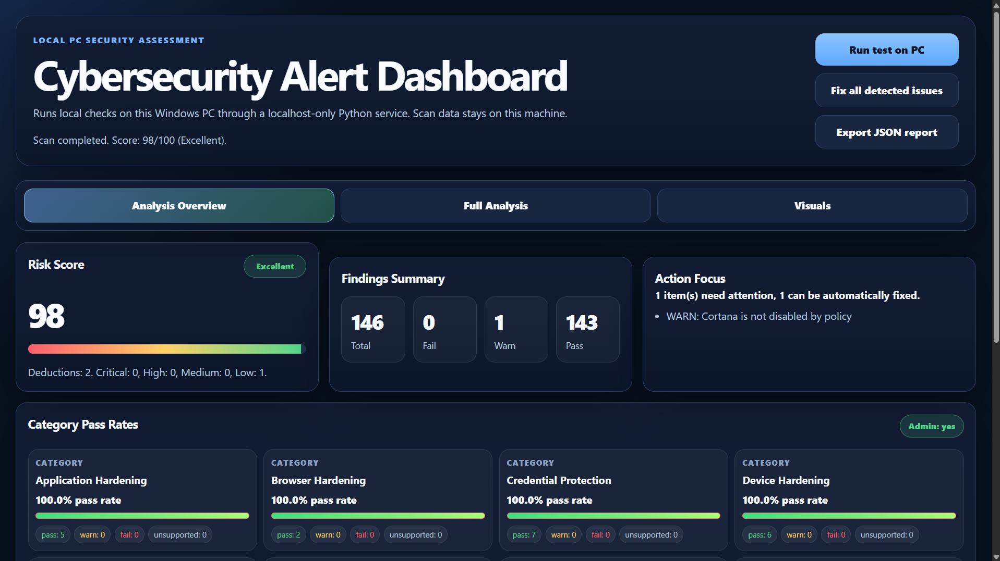
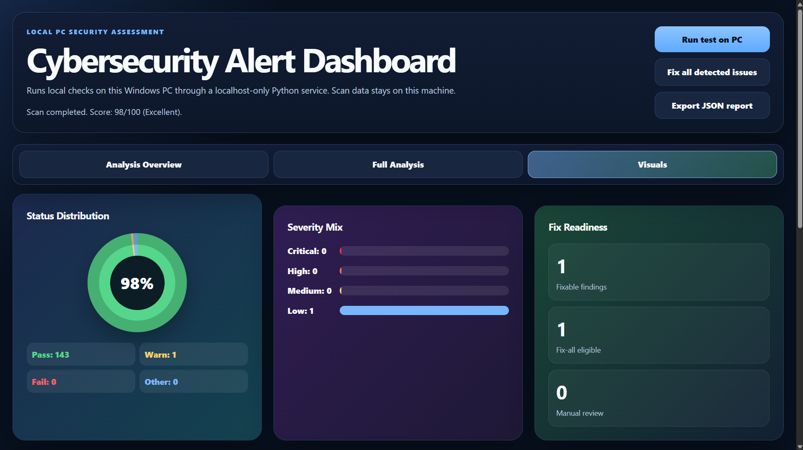
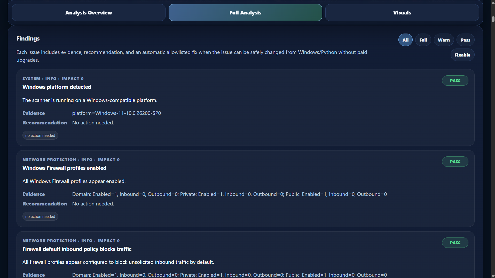
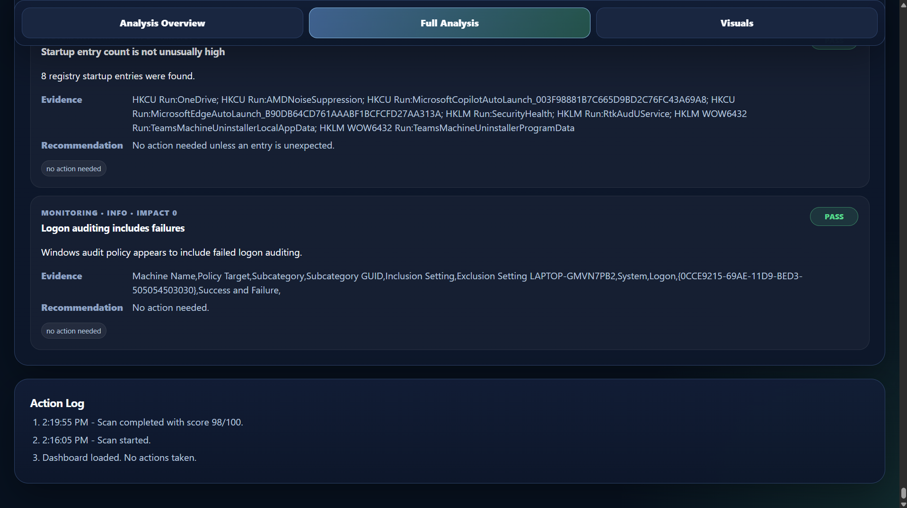
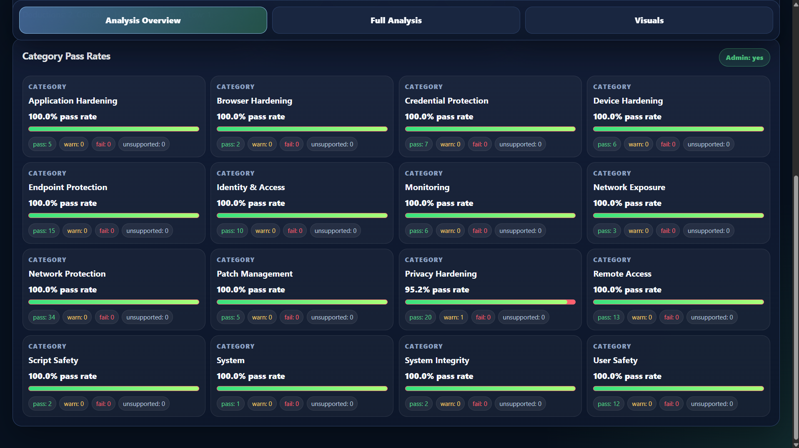

# Cybersecurity Alert Dashboard v10.2

A local Windows cybersecurity assessment and remediation dashboard built with **Python**, **HTML**, **CSS**, and **JavaScript**.

The application evaluates a Windows system against dozens of security best practices, calculates an overall security score, and provides one-click remediation for supported findings. Reports can be exported for documentation and review.

---

## Features

- Windows security posture assessment
- Overall security score calculation
- Risk categorization by severity
- One-click remediation for supported findings
- Windows Registry hardening
- Firewall and networking checks
- Privacy and system configuration checks
- JSON report export
- Action logging
- Interactive dashboard with live results

---

# Dashboard



---

# Security Analytics



---

# Findings



---

# Action Log



---

# Category Overview



---

# Technologies Used

- Python
- HTML5
- CSS3
- JavaScript
- PowerShell
- Windows Registry
- Windows Security Policies
- JSON

---

# Repository Structure

```
cybersecurity-dashboard
│
├── assets/
│   ├── dashboard.png
│   ├── findings.png
│   ├── analytics.png
│   ├── action_log.png
│   └── category_overview.png
│
├── docs/
│   ├── Architecture.md
│   ├── User_Guide.md
│   ├── Checks_and_Remediations.md
│   └── Security_Model.md
│
├── sample_reports/
│   └── sample_report.json
│
├── cyber_dashboard.py
├── Run_Dashboard.bat
├── Run_Dashboard_Admin.bat
├── README.md
├── SECURITY.md
├── CHANGELOG.md
├── ROADMAP.md
├── CONTRIBUTING.md
└── LICENSE
```

---

# Documentation

| Document | Description |
|----------|-------------|
| [User Guide](docs/User_Guide.md) | Installation and usage instructions |
| [Architecture](docs/Architecture.md) | Application architecture |
| [Security Model](docs/Security_Model.md) | Security design principles |
| [Checks & Remediations](docs/Checks_and_Remediations.md) | List of implemented security checks |
| [Security Policy](SECURITY.md) | Reporting vulnerabilities |
| [Roadmap](ROADMAP.md) | Planned improvements |
| [Changelog](CHANGELOG.md) | Version history |

---

# Running the Application

Normal mode

```
Run_Dashboard.bat
```

Administrator mode

```
Run_Dashboard_Admin.bat
```

Or

```
python cyber_dashboard.py
```

---

# Sample Report

Example exported report:

[sample_report.json](sample_reports/sample_report.json)

---

# Current Capabilities

The dashboard currently includes functionality such as:

- Windows security configuration assessment
- Registry hardening
- Network security checks
- Windows service analysis
- Firewall configuration review
- Privacy configuration analysis
- Audit policy verification
- Automated remediation
- Security scoring
- Exportable reports

---

# Future Enhancements

See the project roadmap:

[ROADMAP.md](ROADMAP.md)

Planned improvements include:

- Scheduled security scans
- Additional Windows hardening checks
- CIS Benchmark comparison
- Enhanced reporting
- Expanded security analytics
- Performance optimizations

---

# License

This project is licensed under the MIT License.

See:

[LICENSE](LICENSE)

---

# Author

**Evan Guy**

Computer Science (Cybersecurity) student

Python • Cybersecurity • Automation • Windows Security
